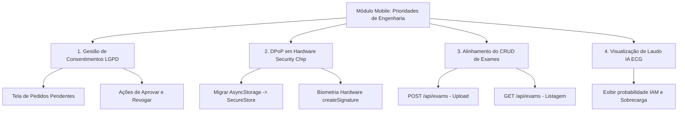

# 🚀 Guia de Desenvolvimento e Próximos Passos
## Aplicativo Centralizador de Exames (Soberania Móvel, DPoP & Gestão de Consentimentos)

> **Projeto:** POHINC — Open Health SaaS (TCC / CONIC SEMESP 2026)  
> **Módulo:** Módulo 3 — Aplicativo do Paciente  
> **Público-alvo:** Desenvolvedores que assumirão o desenvolvimento e finalização do app móvel.

---

## 📑 Índice
1. [Visão Geral e Propósito do Aplicativo](#1-visão-geral-e-propósito-do-aplicativo)
2. [Guia de Execução: Como Rodar o Projeto](#2-guia-de-execução-como-rodar-o-projeto)
   - [2.1. Pré-requisitos de Ambiente](#21-pré-requisitos-de-ambiente)
   - [2.2. Variáveis de Ambiente (.env)](#22-variáveis-de-ambiente-env)
   - [2.3. Dependências de Backend (Microsserviços)](#23-dependências-de-backend-microsserviços)
   - [2.4. Passo a Passo de Inicialização](#24-passo-a-passo-de-inicialização)
3. [Plano de Implementação das Pendências Acadêmicas](#3-plano-de-implementação-das-pendências-acadêmicas)
   - [3.1. Gestão Descentralizada de Consentimentos (LGPD)](#31-gestão-descentralizada-de-consentimentos-lgpd)
   - [3.2. Assinatura DPoP Vinculada a Hardware (Keystore / Secure Enclave)](#32-assinatura-dpop-vinculada-a-hardware-keystore--secure-enclave)
   - [3.3. Alinhamento dos Endpoints de Exames com o Backend](#33-alinhamento-dos-endpoints-de-exames-com-o-backend)
   - [3.4. Exibição de Laudos da IA Multi-Agente de ECG](#34-exibição-de-laudos-da-ia-multi-agente-de-ecg)
4. [Normalização Visual & Design System (POHINC Medical)](#4-normalização-visual--design-system-pohinc-medical)
   - [4.1. Diagnóstico do Descompasso Atual](#41-diagnóstico-do-descompasso-atual)
   - [4.2. Paleta Oficial Unificada (Tokens de Cores)](#42-paleta-oficial-unificada-tokens-de-cores)
   - [4.3. Tipografia e Espaçamentos](#43-tipografia-e-espaçamentos)
   - [4.4. Padronização dos Componentes Base (UI Kit)](#44-padronização-dos-componentes-base-ui-kit)
5. [Cronograma e Checklist de Entregas](#5-cronograma-e-checklist-de-entregas)

---

## 1. Visão Geral e Propósito do Aplicativo

No ecossistema **POHINC (Open Health)**, o aplicativo mobile é o ponto focal da **soberania dos dados do paciente**. Em conformidade com a LGPD e a arquitetura *Privacy by Design*:
* O barramento central **não possui autorização permanente de leitura** sobre os registros médicos dos pacientes.
* O paciente centraliza seu histórico clínico e **autoriza ou revoga expressamente** o acesso de clínicas e médicos parceiros.
* Cada transação sensível de compartilhamento é autenticada criptograficamente via **DPoP (*Demonstrating Proof-of-Possession* — RFC 9449)**, gerando provas assinadas pela chave privada do dispositivo móvel.

---

## 2. Guia de Execução: Como Rodar o Projeto

### 2.1. Pré-requisitos de Ambiente

Para rodar o projeto localmente com suporte a módulos nativos (biometria e criptografia):

| Ferramenta | Versão Mínima / Recomendada | Observações |
| :--- | :--- | :--- |
| **Node.js** | `v20.x` ou `v22.x` (LTS) | Evitar versões ímpares. |
| **npm** | `v10.x` | Gerenciador padrão do projeto. |
| **Java JDK** | OpenJDK 17 | Obrigatório para compilação nativa do Android. |
| **Android Studio** | Versão recente (Iguana/Jellyfish/Koala) | Android SDK Platform 34/35, Build-Tools e Platform-Tools configurados na variável `ANDROID_HOME`. |
| **Expo CLI** | Embutido no projeto via `npx expo` | O projeto utiliza Expo 55 Canary com React Native 0.83.4 e React 19. |

> ⚠️ **Atenção sobre o Expo Go:**  
> A biblioteca de segurança biométrica `react-native-biometrics` possui código nativo em C++/Java. Portanto, **o aplicativo NÃO deve ser executado no Expo Go padrão**, mas sim via **Development Build (`npx expo run:android`)** ou em modo Web para prototipagem rápida de telas.

---

### 2.2. Variáveis de Ambiente (`.env`)

Crie um arquivo `.env` na raiz do repositório `aplicativo_centralizador_de_exames/`:

```env
# URL base da API do Barramento Centralizador
# Escolha a URL de acordo com o seu ambiente de teste:

# Opção A: Teste no Navegador Web
EXPO_PUBLIC_API_BASE_URL=http://localhost:8002

# Opção B: Teste no Emulador Android (10.0.2.2 mapeia para o localhost do seu computador)
# EXPO_PUBLIC_API_BASE_URL=http://10.0.2.2:8002

# Opção C: Teste em Celular Físico via Wi-Fi (substitua pelo IP local da sua máquina)
# EXPO_PUBLIC_API_BASE_URL=http://192.168.1.15:8002

# Opção D: Ambiente de Produção Oficial do TCC
# EXPO_PUBLIC_API_BASE_URL=https://central.pohinc.com.br
```

---

### 2.3. Dependências de Backend (Microsserviços)

Para que o login, cadastro, upload e compartilhamento funcionem, o backend centralizador deve estar ativo:
1. Abra um terminal no repositório `sistema_centralizador_de_dados_clinicos_back/`.
2. Inicie a infraestrutura de suporte via Docker:
   ```bash
   docker-compose up -d
   ```
   *(Isto levantará o MariaDB na porta 3306, Keycloak na porta 8080 e Cassandra na porta 9042)*.
3. Inicie o serviço de usuários e autenticação Go:
   ```bash
   go run services/users/cmd/main.go
   ```
   *(A API estará escutando na porta `8002`)*.

---

### 2.4. Passo a Passo de Inicialização

#### 1. Instalar as Dependências
Como o projeto utiliza React 19 e Expo Canary, utilize a flag de compatibilidade de dependências peer:
```bash
npm install --legacy-peer-deps
```

#### 2. Executar no Modo Web (Rápido para Desenvolvimento Visual)
```bash
npm run web
```
Acesse `http://localhost:8081` no navegador. No modo Web ou em `__DEV__`, o app utiliza automaticamente `src/security/signer.dev.ts` com bypass mockado de biometria.

#### 3. Executar no Emulador ou Celular Android (Build Nativo)
1. Certifique-se de que o emulador está aberto ou o smartphone conectado via USB (`adb devices`).
2. Gere os artefatos nativos e compile a aplicação:
   ```bash
   npx expo run:android
   ```
3. O terminal abrirá o Metro Bundler e fará o deploy do APK de desenvolvimento no dispositivo.

---

## 3. Plano de Implementação das Pendências Acadêmicas

Com base no artigo do **CONIC 2026**, as quatro frentes obrigatórias a serem desenvolvidas no app são:



---

### 3.1. Gestão Descentralizada de Consentimentos (LGPD)

#### Objetivo
Implementar a interface onde o paciente gerencia quais clínicas e médicos têm acesso aos seus exames, atendendo à métrica do artigo de **SUS de 84,2 pontos**.

#### Arquitetura da Solução
1. **Nova Tela:** Criar `src/app/exam-flow/consents.tsx` acessível via Bottom Navigation ou cabeçalho.
2. **Novo Serviço:** Criar `src/services/consents.ts`:
   - `getPendingConsentRequests()`: Busca clínicas que solicitaram acesso via CPF do paciente.
   - `approveConsent(requestId: string)`: Aciona o prompt biométrico, assina o token DPoP e notifica o backend.
   - `revokeConsent(clinicId: string)`: Revoga imediatamente o acesso concedido.
   - `getActiveConsents()`: Lista quem atualmente tem acesso concedido.
3. **Componente de Cartão:** `src/components/ConsentCard.tsx`:
   - Exibe nome da clínica, solicitante, data/hora da solicitação, finalidade informada e botões:
     - 🟢 **Autorizar com Biometria** (Chama `authenticateUser` + assinatura DPoP).
     - 🔴 **Recusar / Bloquear**.

---

### 3.2. Assinatura DPoP Vinculada a Hardware (Keystore / Secure Enclave)

#### Diagnóstico Atual
* Em `src/security/dpop.ts`, a chave privada é salva em texto plano no `AsyncStorage` (`@dpop_private_key`).
* Em `src/security/signer.native.ts`, a assinatura calcula apenas um hash SHA-256 via fallback (`Crypto.digestStringAsync`), sem atrelamento à chave privada do chip de segurança.

#### Plano de Refatoração
1. **Adicionar `expo-secure-store`:**
   ```bash
   npx expo install expo-secure-store
   ```
2. **Atualizar `src/security/dpop.ts`:**
   Substituir chamadas de `AsyncStorage.getItem(PRIVATE_KEY_STORAGE_KEY)` por `SecureStore.getItemAsync(PRIVATE_KEY_STORAGE_KEY, { keychainAccessible: SecureStore.WHEN_UNLOCKED })`.
3. **Atualizar `src/security/signer.native.ts`:**
   Utilizar a API oficial do `react-native-biometrics`:
   ```typescript
   export const sign = async (payload: string) => {
     const { success, signature } = await rnBiometrics.createSignature({
       promptMessage: 'Autorize o compartilhamento médico',
       payload: payload,
       cancelButtonText: 'Cancelar',
     });
     if (!success || !signature) {
       throw new Error('Assinatura biométrica recusada ou falhou.');
     }
     return signature;
   };
   ```

---

### 3.3. Alinhamento dos Endpoints de Exames com o Backend

#### Diagnóstico Atual
Em `src/services/exams.ts`, o app chama rotas como `POST /api/exams` e `GET /api/exams`, que ainda não foram expostas no backend.

#### Ações Necessárias
1. Garantir que os contratos de dados em `src/types/exam-flow-types.ts` correspondam aos campos da tabela `exam` do banco de dados:
   - `id` (UUID)
   - `title` (Título do Exame)
   - `provider` (Clínica / Laboratório)
   - `result` (Resultado / Conclusão)
   - `link_bucket` (Caminho do arquivo)
   - `created_at` (Timestamp)
2. No backend (`sistema_centralizador_de_dados_clinicos_back`), certificar-se de registrar as rotas sob o grupo autenticado com DPoP.

---

### 3.4. Exibição de Laudos da IA Multi-Agente de ECG

#### Diagnóstico Atual
A tela `src/app/(tabs)/test-ai.tsx` foi criada como ambiente de teste isolado e tenta consultar uma rota genérica `POST /api/ai/analyze`.

#### Ações Necessárias
1. Na tela de detalhe do exame cardiológico (`src/app/exam-flow/exam/[id].tsx`), adicionar um card de **Suporte à Decisão Médica (IA)**:
   - Exibir o diagnóstico de consenso:
     - 🩺 *Agente 1 — Infarto:* Elevação de Segmento ST / Risco Isquêmico.
     - 🩺 *Agente 2 — Sobrecarga:* Hipertrofia Ventricular / Bloqueio Condução.
   - Indicador de certeza probabilística (ex: `Score de Confiança: 94%`).
   - Badge de aviso obrigatório da ANVISA (SaMD): *"Resultado preliminar gerado por IA para auxílio à triagem médica"*.

---

## 4. Normalização Visual & Design System (POHINC Medical)

### 4.1. Diagnóstico do Descompasso Atual

Comparando os repositórios da plataforma com o app mobile:

| Elemento | Padrão dos Demais Repositórios (Portal & Centralizador) | Estado Atual do App Móvel |
| :--- | :--- | :--- |
| **Cor Primária** | Verde Floresta Institucional (`#1B5E3B`) e Esmeralda (`#00C853`) | Azul Turquesa / Teal (`#0f766e`) e Azul padrão (`#208AEF`) |
| **Background Claro** | Fundo clínico acinzentado suave (`#F4F7F5`) | Branco puro chapado (`#ffffff`) |
| **Background Escuro** | *Obsidian Green* clínico (`#090E0B`) com cards em `#121A15` | Preto absoluto (`#000000`) com cinza chumbo genérico |
| **Bordas** | Suaves, refinadas (`#E2E8F0` no claro / `#24352A` no escuro) | Cinzas genéricos (`#374151`) |
| **Badges de Status** | Tons translúcidos suaves com texto contrastante | Cores sólidas sem padronização |

---

### 4.2. Paleta Oficial Unificada (Tokens de Cores)

Substituir o conteúdo de `src/constants/theme.ts` pela paleta oficial **POHINC**:

```typescript
// src/constants/theme.ts
import { Platform } from 'react-native';

export const Colors = {
  light: {
    // Cores de Marca (POHINC Open Health)
    primary: '#1B5E3B',          // Verde Floresta Clínico
    primaryLight: '#4A9B6E',     // Verde Suave
    primaryDark: '#0D3320',      // Verde Profundo
    secondary: '#00C853',        // Esmeralda Ativo
    accent: '#009624',           // Realce

    // Superfícies e Fundos
    background: '#F4F7F5',       // Fundo clínico suave (não cansa a vista)
    backgroundElement: '#FFFFFF',// Superfície de cards
    backgroundSelected: '#E5ECE8',
    border: '#E2E8F0',           // Borda sutil

    // Tipografia
    text: '#1E293B',             // Slate escuro de alta legibilidade
    textSecondary: '#64748B',    // Texto secundário
    textMuted: '#94A3B8',

    // Status Semânticos
    success: '#047857',
    successBg: '#D1FAE5',
    warning: '#B45309',
    warningBg: '#FEF3C7',
    error: '#B91C1C',
    errorBg: '#FEE2E2',
    info: '#1D4ED8',
    infoBg: '#DBEAFE',

    tint: '#1B5E3B',
  },
  dark: {
    // Cores de Marca (POHINC Open Health - Modo Escuro)
    primary: '#00C853',          // Verde Vibrante para leitura em fundo escuro
    primaryLight: '#5EE094',
    primaryDark: '#009624',
    secondary: '#1B5E3B',
    accent: '#4A9B6E',

    // Superfícies e Fundos (Obsidian Green)
    background: '#090E0B',       // Preto com nuance verde hospitalar
    backgroundElement: '#121A15',// Card elevado escuro
    backgroundSelected: '#1C2921',
    border: '#24352A',           // Borda verde-escura técnica

    // Tipografia
    text: '#F8FAFC',             // Branco puro para leitura
    textSecondary: '#CBD5E1',
    textMuted: '#64748B',

    // Status Semânticos
    success: '#6EE7B7',
    successBg: 'rgba(16, 185, 129, 0.2)',
    warning: '#FCD34D',
    warningBg: 'rgba(245, 158, 11, 0.2)',
    error: '#FCA5A5',
    errorBg: 'rgba(239, 68, 68, 0.2)',
    info: '#93C5FD',
    infoBg: 'rgba(59, 130, 246, 0.2)',

    tint: '#00C853',
  },
} as const;

export const Spacing = {
  xs: 4,
  sm: 8,
  md: 16,
  lg: 24,
  xl: 32,
  xxl: 48,
} as const;

export const Radius = {
  sm: 6,
  md: 10,
  lg: 16,
  full: 9999,
} as const;
```

---

### 4.3. Tipografia e Espaçamentos

1. **Tipografia:** Garantir o uso da fonte **Inter** ou **Raleway** (já presentes nas dependências via `@expo-google-fonts/raleway`).
2. **Hierarquia:**
   - **Títulos de Seção:** Peso `700` (Bold), tamanho `20px` a `24px`.
   - **Subtítulos e Rótulos:** Peso `600` (SemiBold), tamanho `14px` a `16px`.
   - **Corpo de Texto:** Peso `400` (Regular), tamanho `14px`.
   - **Metadados / Timestamps:** Peso `400` ou `500`, tamanho `12px`.

---

### 4.4. Padronização dos Componentes Base (UI Kit)

Os componentes em `src/components/ui/` devem ser ajustados para refletir a linguagem visual dos outros repositórios:

1. **`Card.tsx`:**
   - Fundo: `Colors[theme].backgroundElement`.
   - Borda: `1px solid ${Colors[theme].border}`.
   - Raio: `Radius.lg` (`16px`).
   - Sombra suave: Elevação sutil sem sombras pretas pesadas.
2. **`Button.tsx`:**
   - Variante Primária: Fundo `Colors[theme].primary`, texto branco (ou preto no dark mode caso use verde neon), raio `Radius.md`.
   - Variante Secundária/Outlined: Fundo transparente, borda `1.5px solid ${Colors[theme].primary}`, texto `Colors[theme].primary`.
   - Feedback de Toque: `activeOpacity={0.8}` com animação suave de transição.
3. **`Badge.tsx`:**
   - Altura compacta, cantos arredondados (`Radius.full`), preenchimento translúcido suave (`successBg`, `warningBg`, `errorBg`) e texto em cor contrastante em negrito (`600`).

---

## 5. Cronograma e Checklist de Entregas

Utilize este roteiro para acompanhar os entregáveis:

### Fase 1: Padronização Visual & UI Kit (1 a 2 dias)
- [ ] Atualizar `src/constants/theme.ts` com a paleta oficial POHINC.
- [ ] Refatorar os componentes base em `src/components/ui/` (`Button`, `Card`, `Badge`, `Input`).
- [ ] Harmonizar as telas existentes (`index.tsx`, `signup.tsx`, `home.tsx`, `exam/[id].tsx`, `settings.tsx`).

### Fase 2: Segurança & Hardware DPoP (2 dias)
- [ ] Migrar armazenamento de chaves de `AsyncStorage` para `expo-secure-store`.
- [ ] Ajustar `src/security/signer.native.ts` com `createSignature` biométrico real no chip de segurança.
- [ ] Validar a integridade dos cabeçalhos DPoP na comunicação com o backend centralizador.

### Fase 3: Gestão de Consentimentos LGPD (2 a 3 dias)
- [ ] Criar o serviço `src/services/consents.ts`.
- [ ] Implementar a tela `src/app/exam-flow/consents.tsx`.
- [ ] Criar o componente `ConsentCard.tsx` com ações de aprovar/revogar acesso.
- [ ] Adicionar navegação para a tela de consentimentos a partir da home do paciente.

### Fase 4: Integração de Exames & Suporte à Decisão de IA (2 dias)
- [ ] Validar rotas reais de upload, listagem e download de exames (`POST/GET /api/exams`).
- [ ] Adicionar o card de resultado da inferência de ECG (1D-CNN) na visualização de detalhes do exame.
- [ ] Testar fluxo completo ponta a ponta (Paciente sobe exame -> Paciente autoriza clínica -> Clínica consulta no portal web).

---

## 6. Novas Funcionalidades de Alto Impacto (App ↔ Backend)

Para enriquecer o TCC e demonstrar excelência técnica perante a banca avaliadora, foram desenhadas 4 novas funcionalidades que conectam o aplicativo mobile ao backend centralizador. 

> 💡 **Nota para o Desenvolvedor que usa IA:**  
> O arquivo [GUIA_INTEGRACAO_APP.md](file:///c:/Users/iisai/OneDrive/Desktop/TCC/sistema_centralizador_de_dados_clinicos_back/GUIA_INTEGRACAO_APP.md) na raiz do repositório do backend já possui todos os structs Go, endpoints e queries prontos. Abaixo estão as instruções exatas de como consumir cada uma delas no app móvel.

---

### 6.1. Funcionalidade A: QR Code Temporal de Acesso Presencial (Fast Track)

#### O que é:
No consultório médico ou recepção hospitalar, em vez de passar CPF e aguardar e-mail, o paciente abre o app e toca em **"Gerar Acesso Rápido"**. A tela exibe um código numérico de 6 dígitos em fonte grande e um QR Code dinâmico com cronômetro regressivo de 5 minutos.

#### Como o App consome:
1. **Endpoint no Backend:** `POST /api/users/qr-token`
2. **Serviço no App (`src/services/auth.ts` ou `src/services/tokens.ts`):**
   ```typescript
   export async function generateQuickAccessToken(): Promise<{ tokenCode: string; expiresIn: number }> {
     return authenticatedRequest(`${API_BASE_URL}/api/users/qr-token`, {
       method: 'POST',
     });
   }
   ```
3. **UI / Componente:** Modal com texto centralizado:
   - Exibir `tokenCode` (ex: `849 201`) formatado.
   - Timer regressivo visual de 5 minutos (ex: `04:59`).
   - Botão para renovar o código caso expire.

---

### 6.2. Funcionalidade B: Trilha de Auditoria do Paciente ("Quem Acessou Meus Dados?")

#### O que é:
Cumprindo rigorosamente o artigo 18 da LGPD, o paciente pode ver exatamente quais instituições ou médicos consultaram seu prontuário, com data, hora e tipo de acesso (inclusive com destaque em vermelho para o acesso emergencial *"Break the Glass"*).

#### Como o App consome:
1. **Endpoint no Backend:** `GET /api/users/audit-trail`
2. **Interface TypeScript (`src/types/exam-flow-types.ts`):**
   ```typescript
   export interface AuditLogItem {
     id: number;
     clinic_id: string;
     clinic_name: string;
     requester_email: string;
     request_type: 'token' | 'break_the_glass' | 'hl7_download';
     justification?: string;
     created_at: string;
   }
   ```
3. **Serviço no App:**
   ```typescript
   export async function getAuditTrail(): Promise<AuditLogItem[]> {
     return authenticatedRequest(`${API_BASE_URL}/api/users/audit-trail`, {
       method: 'GET',
     });
   }
   ```
4. **UI:** Nova aba em Configurações ou card na Home com badges coloridos:
   - 🟢 `Token OTP`: Consulta regular agendada.
   - 🔴 `Break the Glass`: Alerta vermelho destacando a justificativa médica (ex: "Urgência cardiológica / Paciente inconsciente").

---

### 6.3. Funcionalidade C: Central de Gestão de Permissões Médicas

#### O que é:
Listagem clara de quem tem acesso ativo aos exames do paciente, com botão instantâneo de revogação.

#### Como o App consome:
1. **Listar:** `GET /api/users/consents`
2. **Autorizar:** `POST /api/users/consents/approve` (Payload: `{ doctorId, examId, dpopSignature }`)
3. **Revogar:** `DELETE /api/users/consents/:id`
4. **UI:** Tela `src/app/exam-flow/consents.tsx` com lista de médicos autorizados e botão com ícone de lixeira / cadeado para revogar em 1 toque.

---

### 6.4. Funcionalidade D: Assistente de Triagem com IA & Interpretação de Laudos

#### O que é:
Integração da tela `test-ai.tsx` na jornada do paciente. Quando o paciente estiver na tela de detalhes de um exame cardiológico (`exam/[id].tsx`), ele pode tocar em **"Explicar Exame com IA"**. O app envia a conclusão do laudo e recebe uma explicação simplificada em linguagem leiga com aviso regulatório SaMD.

#### Como o App consome:
1. **Endpoint no Backend:** `POST /api/ai/analyze`
2. **Payload:**
   ```json
   {
     "query": "Explique o seguinte laudo: Elevação do segmento ST em V2-V4 com inversão de onda T"
   }
   ```
3. **Retorno do Backend:**
   ```json
   {
     "analysis": "O exame aponta alterações sugestivas de sobrecarga ou isquemia na parede anterior do coração...",
     "confidence": 0.92,
     "disclaimer": "⚠️ AVISO REGULATÓRIO: Análise gerada por algoritmo de suporte clínico...",
     "agent": "POHINC Decision Support Agent"
   }
   ```

---

### 6.5. Guia Rápido de Prompts para o Desenvolvedor Usar em IAs

Se o desenvolvedor for utilizar ferramentas de IA (como ChatGPT, Claude ou Gemini) para gerar as telas ou serviços, ele pode utilizar os seguintes prompts estruturados:

> 🤖 **Prompt para Gerar a Tela de Consentimentos:**  
> *"Atue como um desenvolvedor sênior em React Native com Expo Router e TypeScript. Crie a tela `src/app/exam-flow/consents.tsx` que consome as funções `getConsents()` e `revokeConsent(id)` de `src/services/consents.ts`. Utilize os tokens de tema de `src/constants/theme.ts` (cores `#1B5E3B` no claro e `#090E0B` no escuro), componentes de Card e Button da pasta `src/components/ui/` e suporte a Dark Mode via `useTheme()`. Inclua um estado de carregamento e mensagem caso não haja consentimentos ativos."*

> 🤖 **Prompt para Gerar o Modal de QR Code:**  
> *"Atue como um desenvolvedor React Native. Crie o componente `QuickAccessModal.tsx` que chama `POST /api/users/qr-token`, exibe um código de 6 dígitos em destaque grande com contagem regressiva de 5 minutos (`mm:ss`) e botão de fechar e renovar token. Siga o padrão estético POHINC com cantos arredondados de 16px e suporte a tema claro e escuro."*
